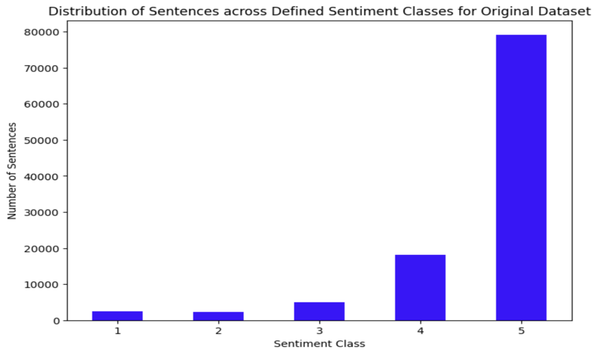
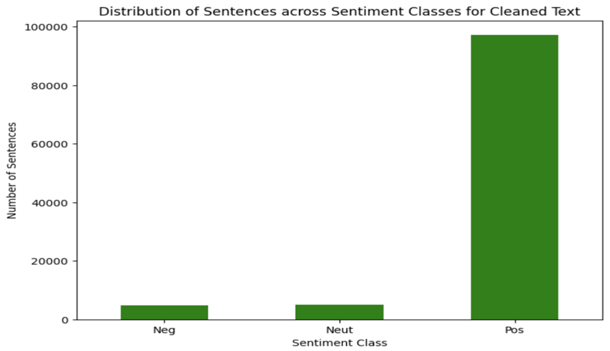
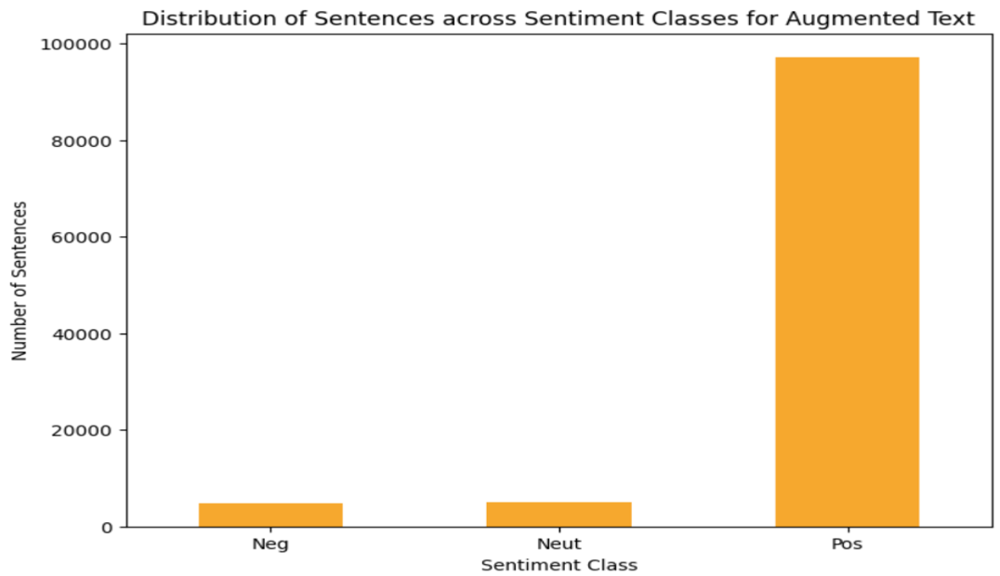
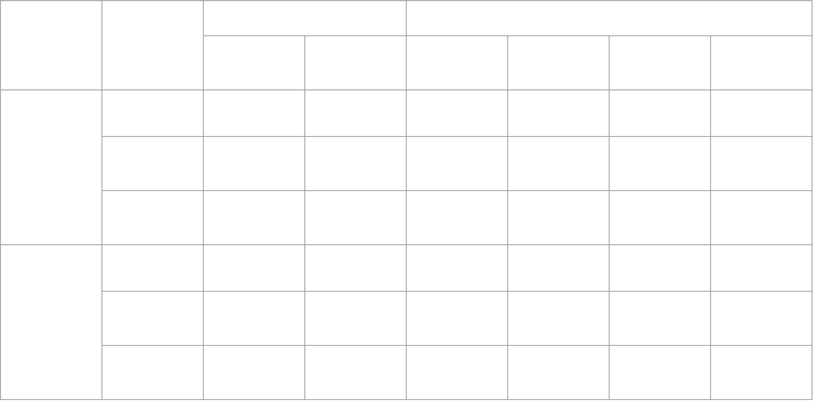

# 📊 Sentiment Analysis of Course Reviews

This project implements sentiment analysis on student-written course reviews, classifying them into **Positive**, **Neutral**, or **Negative** sentiments. The analysis aims to assist educational institutions in understanding student feedback and improving course quality.

---

## 📁 Dataset

The project uses the **100K Coursera Course Reviews** dataset scraped from Kaggle. Each entry includes:
- A unique ID
- The review text
- A rating (1 to 5)

> ⭐ Ratings 4–5 → Positive  
> ⭐ Rating 3 → Neutral  
> ⭐ Ratings 1–2 → Negative  

  
   
  <em>Fig: Original Rating Distribution (Highly Imbalanced)</em>

---

## 🛠️ Methodology

### 🔹 Preprocessing
- Lowercasing
- Removing punctuation/symbols
- Tokenization
- Stopword removal

  
   
  <em>Fig: Cleaned Text Preprocessing</em>

### 🔹 Data Augmentation
- **Synonym Replacement** using WordNet  
- **Random Deletion** with 20% probability

  
   
  <em>Fig: Data Augmentation Techniques</em>

### 🔹 Feature Extraction
- **Bag-of-Words Vectorization** to convert text to numerical features

### 🔹 Imbalance Handling
- **SMOTE (Synthetic Minority Over-sampling Technique)** used to oversample Neutral and Negative classes

---

## 🤖 Classifiers Used

Three ML classifiers were trained on both **cleaned** and **augmented** text:
- Naive Bayes
- Decision Tree
- Random Forest (100 estimators)

> Train-test split: **80-20**  
> Evaluation: **10-fold Cross-Validation**

---

## 📈 Results

| Model         | Cleaned Text Accuracy | Augmented Text Accuracy |
|---------------|-----------------------|--------------------------|
| Naive Bayes   | Lower                 | Improved                 |
| Decision Tree | Better Negative Class | Improved Overall         |
| Random Forest | **Best Overall**      | **Best Overall**         |

  
   
  <em>Fig: Accuracy Comparison Across Models</em>

---

## 🔍 Key Insights

- **Data Augmentation** enhances model performance across all classifiers
- **Random Forest** achieves the highest classification accuracy
- **SMOTE** effectively balances the class distribution
- Negative sentiment detection benefits from **Decision Trees**

---

## 🙌 Acknowledgments

- Coursera review dataset via Kaggle
- WordNet for synonym augmentation
- Scikit-learn for modeling & evaluation
